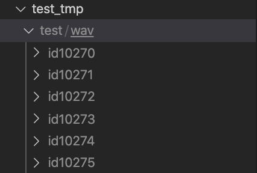
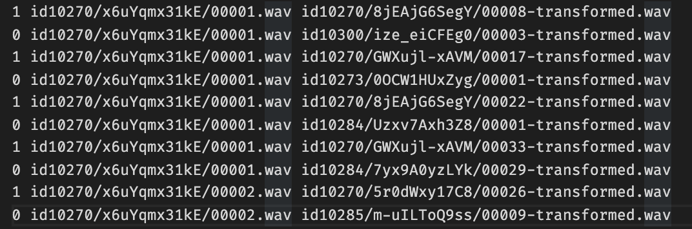

# audio_attack-ML

## Training
1. Install [Kaldi](https://github.com/kaldi-asr/kaldi) on your PC or server. 
    - Change the directory to line 2 in path.sh
2. Download Voxceleb dataset (for simple version we just need version 1) on your PC or server. 
    - Change the directory to line 12 in run.sh
3. run `source ./prepare.sh && source ./run.sh`

## Testing
1. After training, make sure you have an exp folder under this directory.
    - It should contains blahblah
2. Make a test_tmp folder
    - It should have a test/wav folder which contains all your test audio files 

    
    - And it should have a `voxceleb1_test_v2.txt` which contains all the audio files you want to score. Remember to the first character in the line means whether these two audio comes from one speaker

    
3. run `source ./prepare.sh && source ./test.sh`